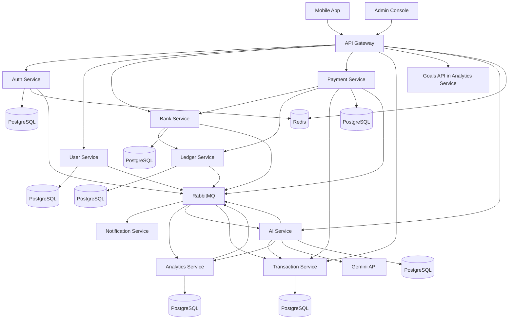
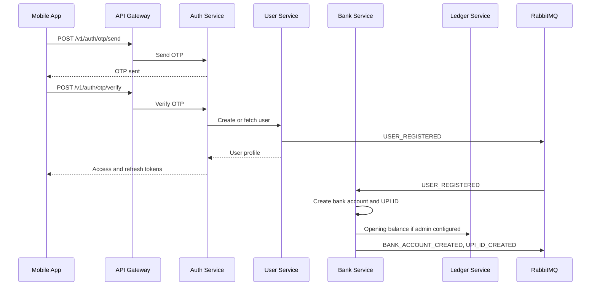
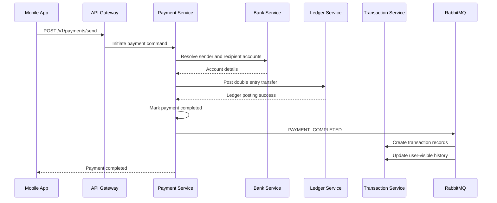

# VERO AI System Architecture

## 1. Architecture Summary

VERO AI uses a domain-oriented service architecture with synchronous REST APIs for user-facing requests and asynchronous events for downstream processing. Ledger operations are strongly consistent. Notifications, analytics, AI insight generation, and read-model updates are eventually consistent.

The system is intentionally sandboxed. It has no NPCI, bank, card, or real payment network dependencies.

## 2. High Level Architecture Diagram

## 3. Services

| Service | Primary Role | Consistency Model |
| --- | --- | --- |
| API Gateway | Public entry point, routing, auth enforcement, rate limits | Stateless |
| Auth Service | OTP login, token issuing, session lifecycle | Strong for auth state |
| User Service | User profile and lifecycle | Strong for user identity |
| Bank Service | Virtual bank accounts and UPI IDs | Strong for account ownership |
| Ledger Service | Double entry accounting and balance read model | Strong |
| Payment Service | Payment orchestration and state machine | Strong for payment state |
| Transaction Service | User-visible transaction history | Eventually consistent from payments and ledger |
| Analytics Service | Goals, aggregates, spend metrics | Eventually consistent |
| Notification Service | In-app notifications and future push/SMS | Eventually consistent |
| AI Service | Gemini integration and financial intelligence | Eventually consistent for generated insights |

## 4. Service Communication

### 4.1 External Communication

- Mobile App and Admin Console communicate only with API Gateway.
- API Gateway exposes versioned REST endpoints under `/v1`.
- Gateway validates JWT access tokens for protected routes.
- Gateway forwards authenticated identity context to internal services.
- Gateway enforces request size, timeouts, rate limits, and idempotency key presence for mutating payment APIs.

### 4.2 Internal Synchronous Communication

Internal services use private network REST calls for request-response operations that require immediate decisions:

| Caller | Callee | Purpose |
| --- | --- | --- |
| Gateway | Auth Service | OTP send, OTP verify, token refresh |
| Gateway | Payment Service | Initiate payment, approve request, fetch payment status |
| Payment Service | Bank Service | Resolve UPI ID and validate account status |
| Payment Service | Ledger Service | Reserve or post ledger transfer |
| Bank Service | Ledger Service | Create opening balance ledger posting |
| AI Service | Transaction Service | Retrieve transaction data for grounded AI answers |
| AI Service | Analytics Service | Retrieve aggregates and goals |

### 4.3 Internal Asynchronous Communication

RabbitMQ is used for domain events:

- Lifecycle events: `USER_REGISTERED`, `BANK_ACCOUNT_CREATED`, `UPI_ID_CREATED`.
- Money movement events: `PAYMENT_INITIATED`, `PAYMENT_COMPLETED`, `PAYMENT_FAILED`, `BALANCE_UPDATED`.
- Product events: `GOAL_CREATED`, `GOAL_COMPLETED`, `AI_INSIGHT_GENERATED`.

Events are published after the owning database transaction commits using the outbox pattern. Consumers must be idempotent.

## 5. API Gateway

### 5.1 Responsibilities

- TLS termination.
- API version routing.
- JWT verification for protected routes.
- Request correlation ID generation.
- Rate limiting by IP, mobile number, user ID, and endpoint.
- Idempotency key validation for payment mutation routes.
- Request and response logging with PII redaction.
- Service discovery and load balancing.

### 5.2 Gateway Policy

| Policy | Value |
| --- | --- |
| Public API prefix | `/v1` |
| Request timeout | 5 seconds default, 15 seconds for AI chat |
| Max body size | 1 MB for normal APIs, 4 MB for AI chat |
| Correlation header | `X-Request-ID` |
| Idempotency header | `Idempotency-Key` |
| Auth header | `Authorization: Bearer <access_token>` |

## 6. Event Driven Design

### 6.1 Outbox Pattern

Each service that publishes events writes the event to an `outbox_events` table in the same transaction as the domain change. A publisher worker reads unprocessed outbox rows and publishes to RabbitMQ. This prevents database commit success with event publish failure.

### 6.2 Consumer Idempotency

Consumers store processed event IDs. If RabbitMQ redelivers an event, the consumer checks event ID and skips duplicate side effects.

### 6.3 Event Envelope

Every event uses a standard envelope:

| Field | Description |
| --- | --- |
| `event_id` | Globally unique event ID. |
| `event_type` | Domain event name. |
| `event_version` | Schema version. |
| `occurred_at` | Timestamp when domain change occurred. |
| `published_at` | Timestamp when broker publish occurred. |
| `correlation_id` | Request trace ID. |
| `causation_id` | Upstream event or command ID. |
| `producer` | Publishing service. |
| `payload` | Event-specific body. |

## 7. Request Flow

### 7.1 Registration and Provisioning

### 7.2 Send Money

## 8. Data Flow

### 8.1 Write Path

- User command enters Gateway.
- Gateway authenticates and forwards to owning service.
- Owning service validates command and writes domain state.
- If event-producing, service writes outbox event in same transaction.
- Outbox publisher publishes event to RabbitMQ.
- Consumers update projections, notifications, analytics, or AI insight queues.

### 8.2 Read Path

- Payment status reads from Payment Service.
- Balance reads from Ledger Service balance projection.
- Transaction history reads from Transaction Service.
- Goals and aggregates read from Analytics Service.
- AI answers retrieve structured data through Transaction and Analytics services, then call Gemini for language generation.

## 9. Failure Handling

### 9.1 Payment Failure Modes

| Failure | Handling |
| --- | --- |
| Invalid recipient UPI ID | Reject before payment creation or mark payment failed if created. |
| Insufficient funds | Ledger Service rejects transfer; Payment Service marks failed. |
| Ledger timeout | Payment remains pending until reconciliation worker confirms state. |
| Duplicate idempotency key | Return original payment response. |
| Event publish failure | Outbox worker retries; payment state remains committed. |
| Consumer failure | RabbitMQ retries with exponential backoff, then dead-letter queue. |

### 9.2 Consistency Recovery

- Payment reconciliation compares completed payments with ledger postings.
- Ledger reconciliation ensures every posting has total debits equal total credits.
- Transaction reconciliation rebuilds user-visible transactions from payment and ledger events.
- Event replay can reconstruct projections for Transaction, Analytics, Notification, and AI services.

### 9.3 Circuit Breakers

- AI Service uses circuit breaker around Gemini calls.
- Payment Service uses short timeouts for Bank and Ledger calls.
- Gateway returns degraded but explicit errors when downstream services are unavailable.

## 10. Scalability Considerations

### 10.1 Horizontal Scaling

- Gateway, Auth, User, Bank, Payment, Transaction, Analytics, Notification, and AI services are stateless at runtime and scale horizontally.
- Redis supports shared OTP state, token revocation lists, and rate limits.
- RabbitMQ workers scale by queue partition and consumer group.

### 10.2 Database Scaling

- PostgreSQL primary handles writes.
- Read replicas can serve transaction history, analytics, and AI retrieval.
- Ledger write path remains carefully serialized by account or posting group.
- Hot account protection prevents concurrent conflicting ledger mutations.

### 10.3 Queue Scaling

- Separate exchanges for `identity`, `banking`, `payments`, `ledger`, `goals`, and `ai`.
- Dead-letter queues per domain.
- Consumer prefetch tuned per workload.
- AI insight generation queue isolated from payment-critical queues.

### 10.4 Caching

- Cache public configuration and non-sensitive lookup data.
- Do not cache authoritative balances unless cache entries are versioned by ledger sequence.
- UPI ID resolution may be cached briefly with invalidation on account or UPI status change.

## 11. Reliability Targets

| Flow | Target |
| --- | --- |
| OTP send | p95 under 1.5 seconds excluding external SMS provider |
| OTP verify | p95 under 300 ms |
| Send money | p95 under 800 ms |
| Balance read | p95 under 150 ms |
| Transaction list | p95 under 300 ms |
| AI chat | p95 under 8 seconds with graceful timeout |
| Event publish lag | p95 under 5 seconds |

## 12. Trust Boundaries

- Mobile App is untrusted.
- API Gateway is the first trusted backend boundary.
- Auth Service owns identity and token state.
- Ledger Service is the accounting authority.
- Payment Service orchestrates but does not directly mutate balances.
- AI Service can read scoped financial data but cannot execute payments or update ledger.
- Admin actions require separate role checks and audit logging.

