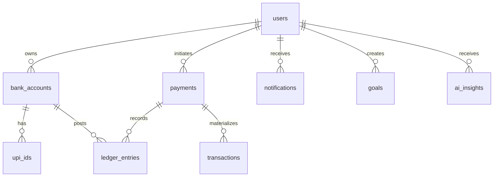

# VERO AI Database Design

## 1. Database Strategy

VERO AI uses PostgreSQL as the primary system of record. Each domain service owns its tables logically. In early development, all tables may live in a single PostgreSQL instance and database. In production, schemas can be split by service or moved into separate databases without changing ownership boundaries.

## 2. Naming and Data Standards

| Standard | Decision |
| --- | --- |
| Primary keys | UUID v4 or UUID v7. |
| Timestamps | `TIMESTAMPTZ` in UTC. |
| Money | `NUMERIC(18,2)` for virtual INR values. |
| Currency | `CHAR(3)`, default `INR`. |
| Status values | PostgreSQL enums or constrained text. |
| Soft delete | Use `deleted_at` only where business records can be hidden. Financial records are immutable. |
| PII | Mobile numbers encrypted or tokenized for storage, normalized hash for lookup. |
| Metadata | `JSONB` for extensible non-critical attributes. |

## 3. Entity Relationship Diagram

## 4. Table: users

Owned by User Service.

| Column | Type | Null | Description |
| --- | --- | --- | --- |
| `id` | `UUID` | No | Primary key. |
| `mobile_number_hash` | `VARCHAR(128)` | No | Deterministic hash for lookup. |
| `mobile_number_encrypted` | `TEXT` | No | Encrypted mobile number for display and SMS. |
| `display_name` | `VARCHAR(120)` | No | User-provided or derived display name. |
| `legal_name` | `VARCHAR(160)` | Yes | Optional sandbox profile name. |
| `status` | `VARCHAR(32)` | No | `ACTIVE`, `SUSPENDED`, `CLOSED`. |
| `registration_source` | `VARCHAR(32)` | No | `MOBILE_APP`, `ADMIN_SEEDED`, `TEST_FIXTURE`. |
| `last_login_at` | `TIMESTAMPTZ` | Yes | Last successful OTP verification. |
| `metadata` | `JSONB` | No | Extensible attributes. |
| `created_at` | `TIMESTAMPTZ` | No | Creation timestamp. |
| `updated_at` | `TIMESTAMPTZ` | No | Last update timestamp. |

### Constraints

- Primary key on `id`.
- Unique constraint on `mobile_number_hash`.
- Check constraint on `status`.
- `metadata` default `{}`.

### Indexes

| Index | Columns | Purpose |
| --- | --- | --- |
| `idx_users_mobile_hash` | `mobile_number_hash` | Login and registration lookup. |
| `idx_users_status` | `status` | Admin filtering. |
| `idx_users_created_at` | `created_at` | Cohort reporting. |

## 5. Table: bank_accounts

Owned by Bank Service.

| Column | Type | Null | Description |
| --- | --- | --- | --- |
| `id` | `UUID` | No | Primary key. |
| `user_id` | `UUID` | No | Owner user ID. |
| `account_number` | `VARCHAR(32)` | No | System-generated virtual account number. |
| `account_type` | `VARCHAR(32)` | No | `SAVINGS`, `SYSTEM`, `SUSPENSE`. |
| `currency` | `CHAR(3)` | No | Default `INR`. |
| `status` | `VARCHAR(32)` | No | `ACTIVE`, `FROZEN`, `CLOSED`. |
| `available_balance` | `NUMERIC(18,2)` | No | Ledger-derived balance projection. |
| `ledger_account_code` | `VARCHAR(64)` | No | Accounting account code. |
| `opened_at` | `TIMESTAMPTZ` | No | Account creation time. |
| `closed_at` | `TIMESTAMPTZ` | Yes | Account closure time. |
| `metadata` | `JSONB` | No | Extensible attributes. |
| `created_at` | `TIMESTAMPTZ` | No | Creation timestamp. |
| `updated_at` | `TIMESTAMPTZ` | No | Last update timestamp. |

### Constraints

- Primary key on `id`.
- Unique constraint on `account_number`.
- Unique constraint on `ledger_account_code`.
- Foreign key `user_id` references `users(id)` logically; physical FK is optional across service databases.
- `available_balance >= 0` for user accounts.
- One active savings account per user in MVP.

### Indexes

| Index | Columns | Purpose |
| --- | --- | --- |
| `idx_bank_accounts_user_id` | `user_id` | Fetch account by user. |
| `idx_bank_accounts_number` | `account_number` | Account lookup. |
| `idx_bank_accounts_status` | `status` | Operational reports. |

## 6. Table: upi_ids

Owned by Bank Service.

| Column | Type | Null | Description |
| --- | --- | --- | --- |
| `id` | `UUID` | No | Primary key. |
| `user_id` | `UUID` | No | Owner user ID. |
| `bank_account_id` | `UUID` | No | Linked virtual account. |
| `upi_id` | `VARCHAR(120)` | No | System-generated UPI handle, for example `sayandeep0001@vero`. |
| `handle` | `VARCHAR(40)` | No | Provider handle, default `vero`. |
| `status` | `VARCHAR(32)` | No | `ACTIVE`, `DISABLED`, `RECLAIMED`. |
| `is_primary` | `BOOLEAN` | No | Primary UPI ID for account. |
| `created_reason` | `VARCHAR(64)` | No | `ACCOUNT_OPENING`, `ADMIN_ROTATION`. |
| `created_at` | `TIMESTAMPTZ` | No | Creation timestamp. |
| `updated_at` | `TIMESTAMPTZ` | No | Last update timestamp. |

### Constraints

- Primary key on `id`.
- Unique constraint on `upi_id`.
- Foreign key `bank_account_id` references `bank_accounts(id)`.
- Check UPI ID format: lowercase alphanumeric plus permitted separators before `@vero`.
- Only one primary active UPI ID per account.

### Indexes

| Index | Columns | Purpose |
| --- | --- | --- |
| `idx_upi_ids_user_id` | `user_id` | User profile lookup. |
| `idx_upi_ids_account_id` | `bank_account_id` | Account mapping. |
| `idx_upi_ids_upi_id` | `upi_id` | Payment recipient resolution. |
| `idx_upi_ids_status` | `status` | Operational filtering. |

## 7. Table: payments

Owned by Payment Service.

| Column | Type | Null | Description |
| --- | --- | --- | --- |
| `id` | `UUID` | No | Primary key. |
| `payment_reference` | `VARCHAR(64)` | No | Human-readable payment reference. |
| `idempotency_key` | `VARCHAR(128)` | No | Client or gateway supplied idempotency key. |
| `payer_user_id` | `UUID` | No | User sending money. |
| `payer_account_id` | `UUID` | No | Payer bank account. |
| `payer_upi_id` | `VARCHAR(120)` | No | Payer UPI ID snapshot. |
| `payee_user_id` | `UUID` | No | User receiving money. |
| `payee_account_id` | `UUID` | No | Payee bank account. |
| `payee_upi_id` | `VARCHAR(120)` | No | Payee UPI ID snapshot. |
| `amount` | `NUMERIC(18,2)` | No | Virtual payment amount. |
| `currency` | `CHAR(3)` | No | Default `INR`. |
| `status` | `VARCHAR(32)` | No | `INITIATED`, `PROCESSING`, `COMPLETED`, `FAILED`, `EXPIRED`, `CANCELLED`. |
| `payment_type` | `VARCHAR(32)` | No | `SEND`, `REQUEST`, `QR`. |
| `note` | `VARCHAR(255)` | Yes | User note. |
| `failure_code` | `VARCHAR(64)` | Yes | Failure reason code. |
| `failure_message` | `VARCHAR(255)` | Yes | Safe user-facing failure message. |
| `ledger_posting_id` | `UUID` | Yes | Ledger posting group ID. |
| `requested_payment_id` | `UUID` | Yes | Parent request payment for collect approval. |
| `expires_at` | `TIMESTAMPTZ` | Yes | Expiry for payment request. |
| `completed_at` | `TIMESTAMPTZ` | Yes | Completion timestamp. |
| `metadata` | `JSONB` | No | QR data, device context, risk flags. |
| `created_at` | `TIMESTAMPTZ` | No | Creation timestamp. |
| `updated_at` | `TIMESTAMPTZ` | No | Last update timestamp. |

### Constraints

- Primary key on `id`.
- Unique constraint on `payment_reference`.
- Unique constraint on `(payer_user_id, idempotency_key)`.
- `amount > 0`.
- `currency = 'INR'` in MVP.
- `payer_account_id <> payee_account_id`.
- Terminal statuses cannot transition back to non-terminal states.

### Indexes

| Index | Columns | Purpose |
| --- | --- | --- |
| `idx_payments_reference` | `payment_reference` | Receipt lookup. |
| `idx_payments_payer_created` | `payer_user_id`, `created_at DESC` | Payer history. |
| `idx_payments_payee_created` | `payee_user_id`, `created_at DESC` | Payee history. |
| `idx_payments_status` | `status` | Reconciliation workers. |
| `idx_payments_idempotency` | `payer_user_id`, `idempotency_key` | Duplicate request protection. |

## 8. Table: transactions

Owned by Transaction Service.

| Column | Type | Null | Description |
| --- | --- | --- | --- |
| `id` | `UUID` | No | Primary key. |
| `user_id` | `UUID` | No | User viewing this transaction. |
| `payment_id` | `UUID` | No | Source payment. |
| `ledger_entry_id` | `UUID` | Yes | Related ledger entry. |
| `direction` | `VARCHAR(16)` | No | `DEBIT` or `CREDIT`. |
| `counterparty_user_id` | `UUID` | Yes | Other user in transfer. |
| `counterparty_upi_id` | `VARCHAR(120)` | No | Counterparty UPI snapshot. |
| `amount` | `NUMERIC(18,2)` | No | Transaction amount. |
| `currency` | `CHAR(3)` | No | Default `INR`. |
| `status` | `VARCHAR(32)` | No | `PENDING`, `COMPLETED`, `FAILED`. |
| `category` | `VARCHAR(64)` | Yes | AI or rules assigned category. |
| `category_source` | `VARCHAR(32)` | Yes | `RULE`, `AI`, `USER`. |
| `description` | `VARCHAR(255)` | No | Display description. |
| `occurred_at` | `TIMESTAMPTZ` | No | User-visible transaction time. |
| `metadata` | `JSONB` | No | Enrichment fields. |
| `created_at` | `TIMESTAMPTZ` | No | Creation timestamp. |
| `updated_at` | `TIMESTAMPTZ` | No | Last update timestamp. |

### Constraints

- Primary key on `id`.
- Unique constraint on `(user_id, payment_id, direction)` for simple transfers.
- `amount > 0`.
- Check constraints for `direction`, `status`, and `category_source`.

### Indexes

| Index | Columns | Purpose |
| --- | --- | --- |
| `idx_transactions_user_time` | `user_id`, `occurred_at DESC` | Timeline API. |
| `idx_transactions_user_category` | `user_id`, `category`, `occurred_at DESC` | Analytics and search. |
| `idx_transactions_payment_id` | `payment_id` | Payment detail lookup. |
| `idx_transactions_counterparty` | `user_id`, `counterparty_upi_id` | Counterparty search. |
| `idx_transactions_metadata_gin` | `metadata` GIN | AI and analytics filters. |

## 9. Table: ledger_entries

Owned by Ledger Service.

| Column | Type | Null | Description |
| --- | --- | --- | --- |
| `id` | `UUID` | No | Primary key. |
| `posting_id` | `UUID` | No | Groups debit and credit entries for one accounting event. |
| `account_id` | `UUID` | No | Bank account or system ledger account. |
| `user_id` | `UUID` | Yes | User owner for user accounts. |
| `payment_id` | `UUID` | Yes | Related payment. |
| `entry_type` | `VARCHAR(16)` | No | `DEBIT` or `CREDIT`. |
| `amount` | `NUMERIC(18,2)` | No | Entry amount. |
| `currency` | `CHAR(3)` | No | Default `INR`. |
| `balance_after` | `NUMERIC(18,2)` | No | Account balance after this entry. |
| `ledger_sequence` | `BIGINT` | No | Monotonic account-level sequence. |
| `entry_reason` | `VARCHAR(64)` | No | `OPENING_BALANCE`, `P2P_TRANSFER`, `REVERSAL`, `ADJUSTMENT`. |
| `description` | `VARCHAR(255)` | No | Accounting description. |
| `metadata` | `JSONB` | No | Reconciliation attributes. |
| `created_at` | `TIMESTAMPTZ` | No | Immutable creation timestamp. |

### Constraints

- Primary key on `id`.
- Unique constraint on `(account_id, ledger_sequence)`.
- `amount > 0`.
- `balance_after >= 0` for user accounts.
- For each `posting_id`, total debits must equal total credits. Enforced by Ledger Service transaction logic and reconciliation checks.
- Ledger rows are append-only. Updates and deletes are prohibited by application policy and database permissions.

### Indexes

| Index | Columns | Purpose |
| --- | --- | --- |
| `idx_ledger_posting_id` | `posting_id` | Posting reconstruction. |
| `idx_ledger_account_sequence` | `account_id`, `ledger_sequence DESC` | Balance and statement reads. |
| `idx_ledger_payment_id` | `payment_id` | Payment reconciliation. |
| `idx_ledger_created_at` | `created_at` | Audit queries. |
| `idx_ledger_user_created` | `user_id`, `created_at DESC` | User ledger history. |

## 10. Table: notifications

Owned by Notification Service.

| Column | Type | Null | Description |
| --- | --- | --- | --- |
| `id` | `UUID` | No | Primary key. |
| `user_id` | `UUID` | No | Recipient user. |
| `type` | `VARCHAR(64)` | No | Notification type. |
| `channel` | `VARCHAR(32)` | No | `IN_APP`, `PUSH`, `SMS`. |
| `title` | `VARCHAR(140)` | No | Display title. |
| `body` | `VARCHAR(500)` | No | Display body. |
| `status` | `VARCHAR(32)` | No | `PENDING`, `SENT`, `READ`, `FAILED`. |
| `source_event_id` | `UUID` | Yes | Event that caused notification. |
| `dedupe_key` | `VARCHAR(160)` | Yes | Prevents duplicate notifications. |
| `sent_at` | `TIMESTAMPTZ` | Yes | Sent timestamp. |
| `read_at` | `TIMESTAMPTZ` | Yes | Read timestamp. |
| `metadata` | `JSONB` | No | Deep links and rendering data. |
| `created_at` | `TIMESTAMPTZ` | No | Creation timestamp. |
| `updated_at` | `TIMESTAMPTZ` | No | Last update timestamp. |

### Constraints

- Primary key on `id`.
- Unique nullable constraint on `dedupe_key`.
- Check constraints on `channel` and `status`.

### Indexes

| Index | Columns | Purpose |
| --- | --- | --- |
| `idx_notifications_user_created` | `user_id`, `created_at DESC` | Notification center. |
| `idx_notifications_status` | `status` | Delivery workers. |
| `idx_notifications_source_event` | `source_event_id` | Event traceability. |

## 11. Table: goals

Owned by Analytics Service.

| Column | Type | Null | Description |
| --- | --- | --- | --- |
| `id` | `UUID` | No | Primary key. |
| `user_id` | `UUID` | No | Goal owner. |
| `name` | `VARCHAR(120)` | No | Goal name. |
| `target_amount` | `NUMERIC(18,2)` | No | Target amount. |
| `current_amount` | `NUMERIC(18,2)` | No | Current saved or tracked amount. |
| `currency` | `CHAR(3)` | No | Default `INR`. |
| `target_date` | `DATE` | Yes | User target date. |
| `status` | `VARCHAR(32)` | No | `ACTIVE`, `COMPLETED`, `PAUSED`, `CANCELLED`. |
| `source` | `VARCHAR(32)` | No | `USER`, `AI_RECOMMENDED`, `ADMIN`. |
| `recommendation_id` | `UUID` | Yes | AI insight that recommended this goal. |
| `completed_at` | `TIMESTAMPTZ` | Yes | Completion timestamp. |
| `metadata` | `JSONB` | No | Goal configuration. |
| `created_at` | `TIMESTAMPTZ` | No | Creation timestamp. |
| `updated_at` | `TIMESTAMPTZ` | No | Last update timestamp. |

### Constraints

- Primary key on `id`.
- `target_amount > 0`.
- `current_amount >= 0`.
- `current_amount <= target_amount` unless overfunding is explicitly enabled.
- Check constraint on `status`.

### Indexes

| Index | Columns | Purpose |
| --- | --- | --- |
| `idx_goals_user_status` | `user_id`, `status` | Active goal list. |
| `idx_goals_target_date` | `target_date` | Reminder and recommendation jobs. |
| `idx_goals_recommendation` | `recommendation_id` | AI traceability. |

## 12. Table: ai_insights

Owned by AI Service.

| Column | Type | Null | Description |
| --- | --- | --- | --- |
| `id` | `UUID` | No | Primary key. |
| `user_id` | `UUID` | No | Insight owner. |
| `insight_type` | `VARCHAR(64)` | No | `SPENDING`, `FORECAST`, `HEALTH_SCORE`, `SUBSCRIPTION`, `GOAL_RECOMMENDATION`, `CHAT_SUMMARY`. |
| `title` | `VARCHAR(160)` | No | User-facing title. |
| `summary` | `TEXT` | No | User-facing explanation. |
| `severity` | `VARCHAR(24)` | No | `INFO`, `POSITIVE`, `WARNING`, `CRITICAL`. |
| `confidence` | `NUMERIC(5,4)` | No | 0.0000 to 1.0000 confidence. |
| `source_window_start` | `DATE` | Yes | Analysis start date. |
| `source_window_end` | `DATE` | Yes | Analysis end date. |
| `model_provider` | `VARCHAR(64)` | No | `GEMINI`. |
| `model_name` | `VARCHAR(120)` | No | Gemini model identifier. |
| `prompt_version` | `VARCHAR(64)` | No | Prompt template version. |
| `source_refs` | `JSONB` | No | Transaction, aggregate, or goal references. |
| `result_payload` | `JSONB` | No | Structured insight output. |
| `status` | `VARCHAR(32)` | No | `GENERATED`, `DISMISSED`, `EXPIRED`. |
| `created_at` | `TIMESTAMPTZ` | No | Creation timestamp. |
| `updated_at` | `TIMESTAMPTZ` | No | Last update timestamp. |

### Constraints

- Primary key on `id`.
- `confidence >= 0` and `confidence <= 1`.
- Check constraints on `insight_type`, `severity`, and `status`.
- `source_refs` and `result_payload` default to `{}`.

### Indexes

| Index | Columns | Purpose |
| --- | --- | --- |
| `idx_ai_insights_user_created` | `user_id`, `created_at DESC` | Insight feed. |
| `idx_ai_insights_type` | `user_id`, `insight_type`, `created_at DESC` | Feature-specific views. |
| `idx_ai_insights_status` | `status` | Expiry and cleanup workers. |
| `idx_ai_insights_payload_gin` | `result_payload` GIN | Debugging and analysis. |

## 13. Cross-Cutting Tables Recommended

The requested core schema should be complemented by operational tables:

| Table | Owner | Purpose |
| --- | --- | --- |
| `otp_challenges` | Auth Service | OTP challenge lifecycle and attempts. |
| `refresh_tokens` | Auth Service | Refresh token rotation and revocation. |
| `audit_logs` | Security Platform | Immutable audit trail for sensitive actions. |
| `outbox_events` | Each publisher | Reliable event publishing. |
| `processed_events` | Each consumer | Idempotent event consumption. |
| `idempotency_keys` | Gateway or owning service | Request replay protection. |

## 14. Data Retention

| Data | Retention |
| --- | --- |
| Users | Retain while account exists; anonymize after closure if required. |
| Payments | Retain permanently in sandbox audit history. |
| Ledger entries | Retain permanently and never mutate. |
| Transactions | Retain permanently as user-facing financial history. |
| OTP challenges | Delete or anonymize after 30 days. |
| AI prompts and responses | Retain minimal structured traces for 30 to 90 days, configurable. |
| Audit logs | Retain at least 1 year for production showcase. |

