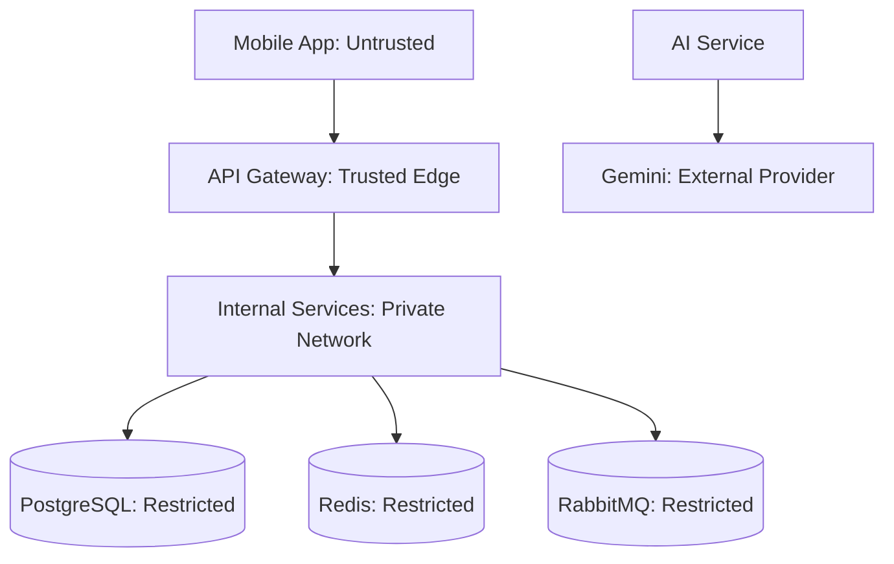

# VERO AI Security Architecture

## 1. Security Overview

VERO AI is a sandbox system, but it should be designed with production-grade fintech controls. The system handles sensitive user identity, virtual balances, transaction history, AI prompts, and authentication tokens. Security design must assume hostile clients, replay attempts, credential theft, and abuse of money movement APIs.

## 2. Trust Boundaries

| Boundary | Control |
| --- | --- |
| Client to Gateway | TLS, JWT, rate limits, schema validation. |
| Gateway to Services | Private network, service auth, request signing or mTLS. |
| Services to Data Stores | Least-privilege credentials and network policies. |
| AI Service to Gemini | Secret-managed API keys, data minimization, timeouts. |

## 3. OTP Authentication

### Flow

1. User submits mobile number.
2. Auth Service normalizes mobile number to E.164.
3. Auth Service creates OTP challenge with expiry and attempt limit.
4. OTP is delivered through configured provider or sandbox stub.
5. User submits OTP and challenge ID.
6. Auth Service verifies OTP hash and marks challenge consumed.
7. Auth Service creates or fetches user through User Service.
8. Auth Service issues access and refresh tokens.

### OTP Controls

| Control | Requirement |
| --- | --- |
| OTP length | 6 digits. |
| OTP TTL | 5 minutes recommended. |
| Storage | Store salted hash, never plaintext OTP. |
| Attempts | Maximum 5 verification attempts per challenge. |
| Resend delay | Minimum 30 seconds. |
| Rate limit | Per mobile number, IP, device, and ASN where available. |
| Replay | Challenge becomes consumed after success. |
| Enumeration protection | OTP send response does not reveal whether user exists. |

## 4. JWT Strategy

### Access Tokens

| Claim | Description |
| --- | --- |
| `sub` | User ID. |
| `sid` | Session ID. |
| `roles` | User roles such as `USER`, `ADMIN`. |
| `scope` | Allowed API scopes. |
| `iat` | Issued at. |
| `exp` | Expiry. |
| `iss` | VERO issuer. |
| `aud` | VERO API audience. |

### Token Policy

- Access token TTL: 15 minutes recommended.
- Sign with asymmetric key pair such as RS256 or ES256.
- Rotate signing keys using `kid`.
- Gateway validates signature, issuer, audience, expiry, and revocation markers.
- Do not store access tokens server-side except revocation metadata where needed.

## 5. Refresh Tokens

### Policy

- Refresh tokens are opaque random values.
- Store hashed refresh tokens in Auth Service database.
- Refresh token TTL: 30 days recommended.
- Rotate refresh token on every use.
- Reuse of an old refresh token invalidates the session family.
- Logout revokes refresh token.

### Device Binding

Recommended metadata:

- Device ID.
- App version.
- IP and region.
- User agent.
- Last used timestamp.

## 6. RBAC

### Roles

| Role | Capabilities |
| --- | --- |
| `USER` | Access own profile, account, payments, transactions, goals, notifications, and AI. |
| `ADMIN` | Sandbox operations, initial balance grants, reconciliation views, event DLQ inspection. |
| `SERVICE` | Internal service-to-service calls. |

### Authorization Rules

- Users can access only resources where `user_id` matches token `sub`.
- Payment detail is visible only to payer or payee.
- Admin balance grants must call Ledger Service and create audit logs.
- AI retrieval must enforce same ownership rules as user-facing APIs.
- Internal APIs require service identity and are not reachable from public internet.

## 7. Rate Limiting

| Surface | Key | Example Limit |
| --- | --- | --- |
| OTP send | Mobile number | 3 per 15 minutes. |
| OTP send | IP address | 10 per hour. |
| OTP verify | Challenge ID | 5 attempts. |
| Send money | User ID | 30 per hour. |
| UPI resolve | User ID and IP | 120 per hour. |
| AI chat | User ID | 20 per hour. |
| Admin APIs | Admin user ID | Strict allowlist and low rate. |

Rate limit responses use HTTP `429` with retry metadata.

## 8. Audit Logs

### Audited Actions

- OTP challenge creation and verification result.
- Login success and failure.
- Token refresh and logout.
- User status changes.
- Bank account creation.
- UPI ID creation and status changes.
- Payment initiation, completion, and failure.
- Ledger postings and reversals.
- Admin initial balance grants.
- AI data retrieval and insight generation.
- Secret and configuration changes.

### Audit Log Fields

| Field | Description |
| --- | --- |
| `audit_id` | Unique audit record ID. |
| `actor_type` | `USER`, `ADMIN`, `SERVICE`, `SYSTEM`. |
| `actor_id` | Actor identifier. |
| `action` | Stable action name. |
| `resource_type` | Resource class. |
| `resource_id` | Resource ID. |
| `request_id` | Correlation ID. |
| `ip_address` | Source IP where available. |
| `user_agent` | Client user agent where available. |
| `result` | `SUCCESS`, `FAILURE`, `DENIED`. |
| `metadata` | Redacted context. |
| `created_at` | Timestamp. |

Audit logs should be append-only and protected from normal service update permissions.

## 9. Fraud Detection Hooks

VERO AI is sandboxed, but fraud hooks demonstrate production thinking.

### Hook Points

- OTP send request.
- OTP verify failure.
- UPI ID resolution.
- Payment initiation.
- Ledger posting rejection.
- Repeated payment failures.
- Admin initial balance grant.

### Signals

- Velocity by user, device, mobile number, and IP.
- Repeated insufficient funds.
- High number of recipient lookups without payments.
- Rapid payments to many recipients.
- Large payment compared with user's history.
- Device or IP change before large payment.
- Admin grant outside normal pattern.

### Actions

- Allow.
- Step-up verification in future.
- Temporarily block payment.
- Freeze account in future.
- Alert operations.
- Add risk metadata to payment.

## 10. Encryption Strategy

### In Transit

- TLS for all public traffic.
- mTLS or service JWT for internal service calls.
- TLS-enabled database, Redis, and RabbitMQ connections in staging and production.

### At Rest

- PostgreSQL volume encryption.
- Redis encryption where supported or private network with minimal retention.
- Object storage encryption if used for logs or exports.

### Field Level Protection

| Field | Protection |
| --- | --- |
| Mobile number | Encrypted for display, deterministic hash for lookup. |
| Refresh token | Hashed with strong one-way hash. |
| OTP | Salted hash, short retention. |
| Gemini API key | Secrets manager only. |
| Audit metadata | Redacted, no raw tokens. |

## 11. Secrets Management

### Requirements

- No secrets committed to source control.
- Environment-specific secrets.
- Secret rotation support.
- Least privilege service credentials.
- Separate credentials for app, migration, read-only analytics, and admin tasks.

### Secrets

- JWT signing private key.
- JWT verification public key set.
- Database credentials.
- Redis credentials.
- RabbitMQ credentials.
- Gemini API key.
- SMS provider credentials.
- Admin bootstrap secret.

## 12. AI Security

### Prompt Injection Controls

- Treat user messages and transaction notes as untrusted input.
- Keep system and developer instructions separate from retrieved user content.
- Gemini must not obey instructions embedded inside transaction notes.
- Response guardrails validate that output does not claim hidden capabilities.

### Data Controls

- AI Service retrieves only current user's data.
- Mobile number and tokens never sent to Gemini.
- Prompt logs are redacted and retention-limited.
- AI cannot call payment mutation APIs.

## 13. Secure Payment Controls

- Idempotency key required for payment mutations.
- Server-side amount validation.
- Server-side UPI ID resolution at execution time.
- Sender and receiver account status validation.
- Ledger Service performs final insufficient funds check.
- Payment state transitions are constrained.
- Completed payments are immutable except for compensating reversal flows in future.

## 14. Operational Security

| Area | Control |
| --- | --- |
| Dependency scanning | Run in CI for service images. |
| Container security | Non-root users, minimal images, read-only filesystem where possible. |
| Network policy | Only Gateway is public. Databases and broker are private. |
| Monitoring | Alert on auth failures, payment failures, DLQ growth, and Gemini errors. |
| Incident response | Runbooks for token compromise, ledger inconsistency, DLQ backlog, and AI provider outage. |

