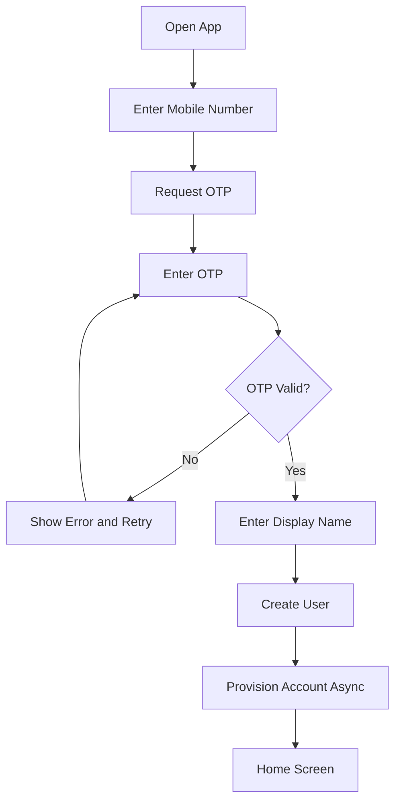
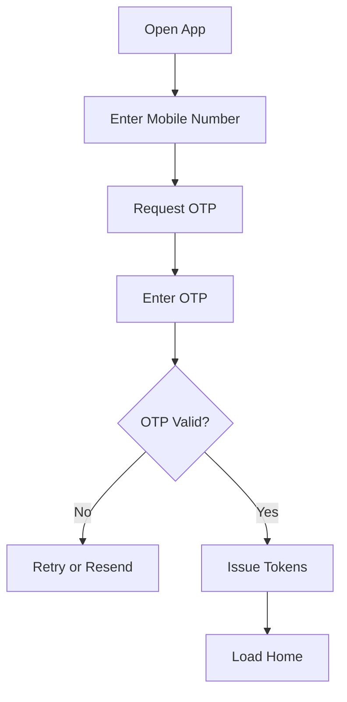
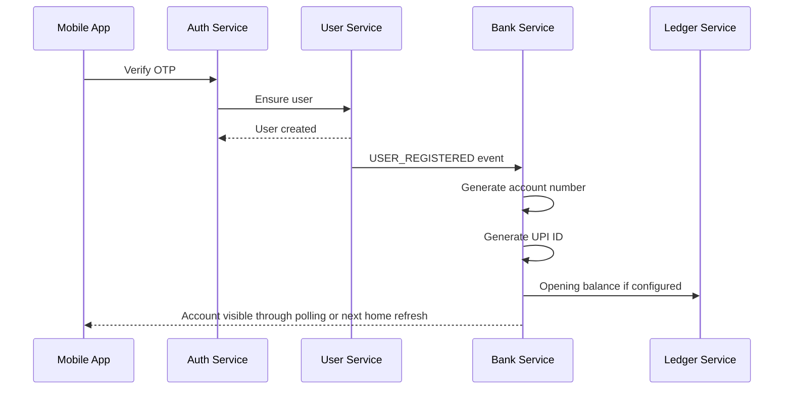
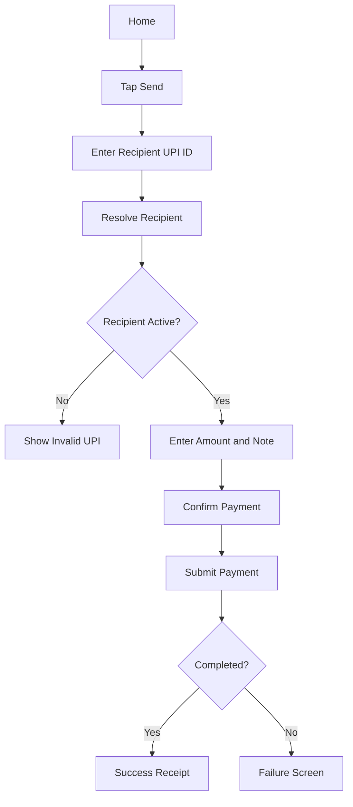
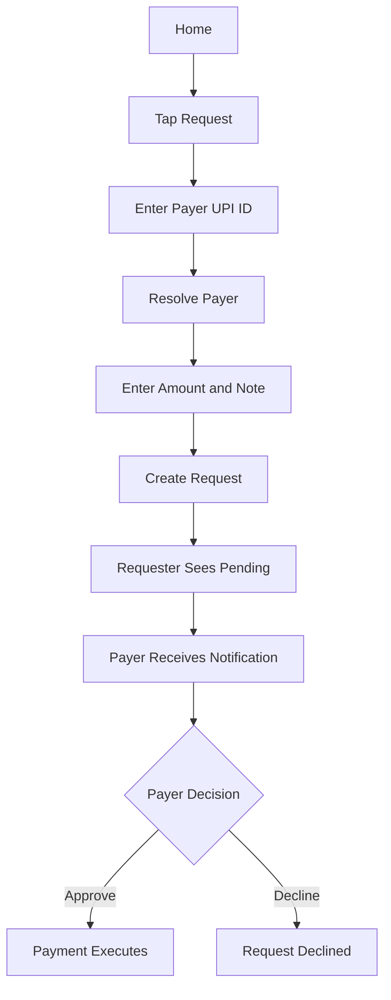
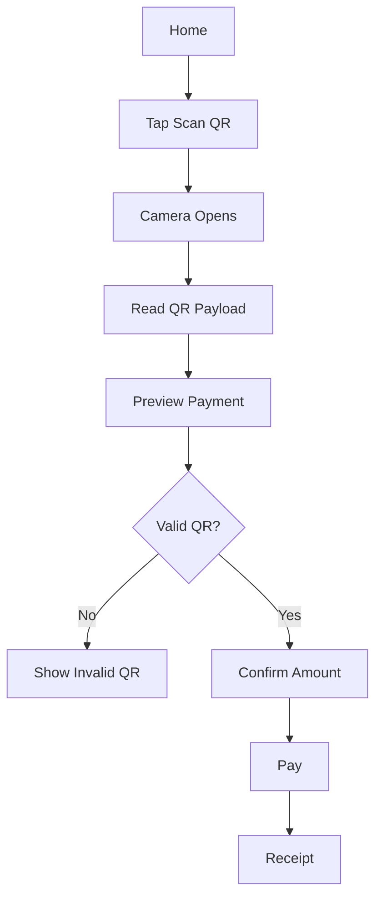
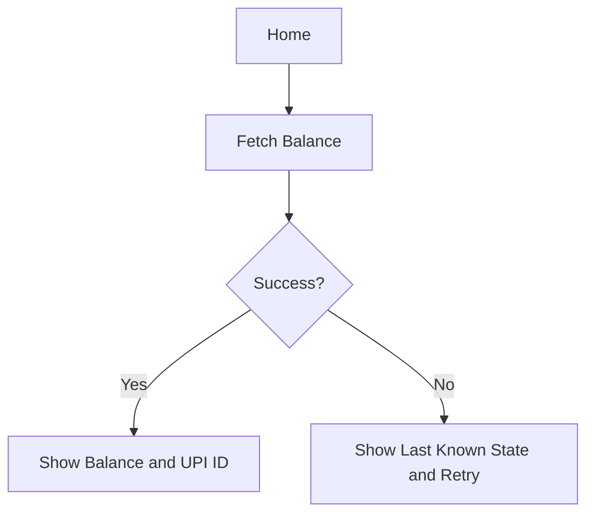
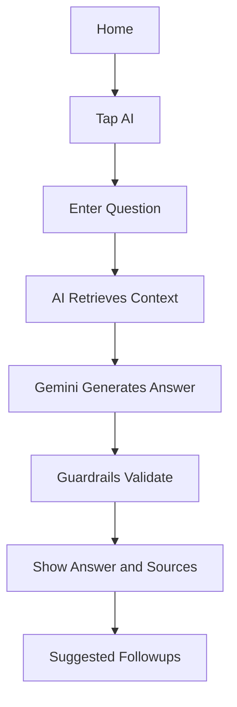
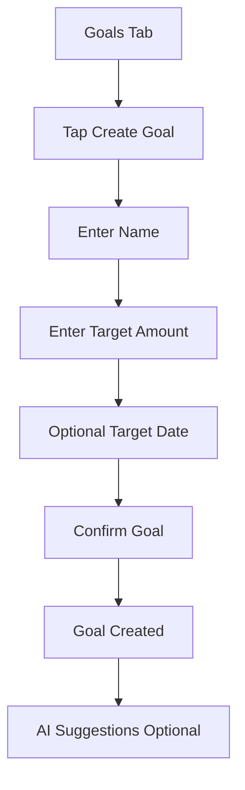
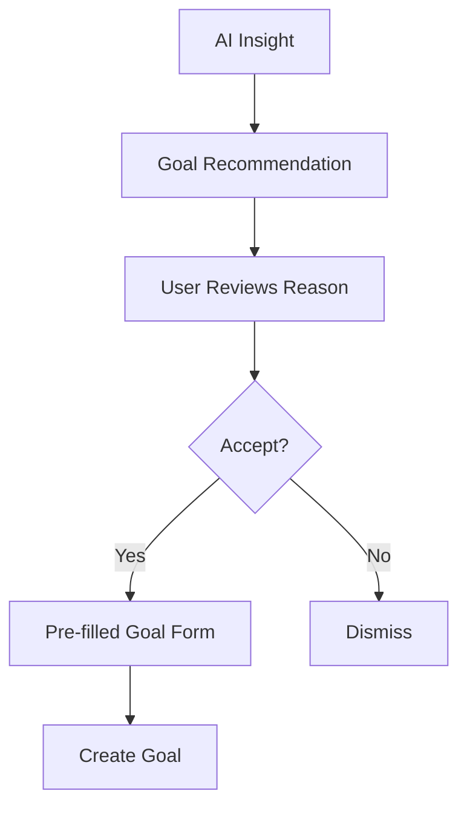

# VERO AI Mobile User Flows

## 1. Flow Design Principles

- Mobile flows should feel like a modern UPI app while clearly representing a sandbox environment.
- Payment confirmation must always show recipient, amount, source account, and note before execution.
- AI flows must explain that insights are generated from virtual VERO activity.
- Failure states must be explicit and recoverable.

## 2. Registration

### Steps

1. User opens app and selects register or continue.
2. User enters mobile number.
3. App calls OTP send API.
4. User enters 6-digit OTP.
5. App calls OTP verify API with display name for first registration.
6. Auth Service creates or fetches user.
7. User Service publishes `USER_REGISTERED`.
8. Bank Service provisions virtual bank account and UPI ID.
9. App lands on home screen and shows provisioning state if account is not ready yet.

### Success State

- User is logged in.
- Virtual bank account is created.
- Primary UPI ID is visible, for example `sayandeep0001@vero`.

### Failure States

| Failure | UX |
| --- | --- |
| OTP expired | Show expired message and resend option. |
| Too many attempts | Temporarily block and show retry time. |
| Account provisioning delayed | Show "Setting up your VERO account" with retry polling. |
| Network error | Allow retry without losing mobile number. |

## 3. Login

### Steps

1. User enters mobile number.
2. App requests OTP.
3. User submits OTP.
4. Auth Service verifies OTP.
5. Auth Service issues access and refresh tokens.
6. App loads profile, account, balance, and recent transactions.

### Success State

- User sees home screen with balance, UPI ID, quick actions, recent transactions, goals, and AI entry point.

## 4. Account Creation

Account creation is automatic and occurs after first registration.

### Steps

1. User completes OTP verification.
2. User Service creates user.
3. Bank Service receives registration event.
4. Bank Service generates virtual account number.
5. Bank Service generates UPI ID from normalized name plus account suffix.
6. Ledger Service initializes ledger account.
7. Admin-controlled initial balance is posted if configured.
8. Mobile app refreshes account state.

### UX Requirements

- Do not ask user to choose a bank.
- Do not ask user to choose a UPI ID in MVP.
- Show account setup progress if provisioning is asynchronous.

## 5. Send Money

### Steps

1. User taps Send.
2. User enters recipient UPI ID.
3. App resolves UPI ID and displays recipient name.
4. User enters amount and optional note.
5. Confirmation screen shows payer UPI ID, payee UPI ID, amount, and note.
6. App submits payment with idempotency key.
7. Payment Service validates and posts ledger transfer.
8. App shows success receipt or failure reason.

### Validation

- Amount must be greater than zero.
- Recipient cannot be the same account.
- Recipient UPI ID must be active.
- User account must be active and funded.

## 6. Request Money

### Steps

1. Requester taps Request.
2. Requester enters payer UPI ID.
3. App resolves payer.
4. Requester enters amount, note, and optional expiry.
5. Payment Service creates request.
6. Payer receives in-app notification.
7. Payer approves or declines.
8. Approval executes payment through normal send money path.

### Failure States

- Request expired.
- Payer has insufficient funds.
- Payer account frozen.
- Request already approved or declined.

## 7. Scan QR

### Steps

1. User taps Scan QR.
2. App scans QR code.
3. App sends QR payload for server-side preview.
4. API returns payee, amount, note, and editability.
5. User confirms payment.
6. App submits QR payment with idempotency key.
7. Payment executes through Payment and Ledger services.

### QR Payload Requirements

- Payee UPI ID.
- Optional fixed amount.
- Optional note.
- Optional reference.
- Optional expiry.
- Future signed QR support.

## 8. Check Balance

### Steps

1. App loads home screen.
2. App calls balance API.
3. Ledger Service returns available balance with sequence and timestamp.
4. App displays balance and recent transactions.

### UX Requirements

- Balance should show currency clearly.
- If refresh fails, show last loaded balance as stale.
- Pull-to-refresh should reload balance and recent transactions.

## 9. AI Chat

### Steps

1. User taps AI assistant.
2. User asks a financial question.
3. AI Service classifies intent.
4. AI Service retrieves scoped transactions, goals, and aggregates.
5. Gemini generates grounded response.
6. Guardrails verify output.
7. App displays answer, source references, confidence, and suggested follow-ups.

### Example Questions

- "How much did I spend on food this month?"
- "Find transactions above INR 500."
- "Do I have any subscriptions?"
- "Can I reach my phone goal by August?"

### Failure States

- AI unavailable: show graceful retry.
- Not enough data: explain what data is needed.
- Unsupported advice request: provide safe educational response.

## 10. Goal Creation

### Steps

1. User opens Goals tab.
2. User taps Create Goal.
3. User enters goal name and target amount.
4. User optionally sets target date.
5. App validates fields.
6. Analytics Service creates goal.
7. Service publishes `GOAL_CREATED`.
8. App shows goal progress and optional AI suggestions.

### AI Recommended Goal Flow

### UX Requirements

- Goal creation should never move money in MVP.
- Clearly distinguish target tracking from locked savings.
- AI recommendations must explain why the goal is suggested.

## 11. Home Screen Information Architecture

Recommended home sections:

| Section | Content |
| --- | --- |
| Balance header | Available balance, primary UPI ID, refresh state. |
| Quick actions | Send, Request, Scan QR, AI. |
| Recent activity | Last 5 transactions. |
| Goals | Active goals and progress. |
| AI insights | Latest high-value insight. |
| Notifications | Unread alerts. |

## 12. Cross-Flow Error UX

| Error | UX Pattern |
| --- | --- |
| Network timeout | Show retry and preserve form data. |
| Unauthorized | Refresh token; if failed, return to login. |
| Rate limited | Show wait time. |
| Validation error | Inline field error. |
| Payment failed | Dedicated failure receipt with reason. |
| Service unavailable | Friendly outage message and retry. |

