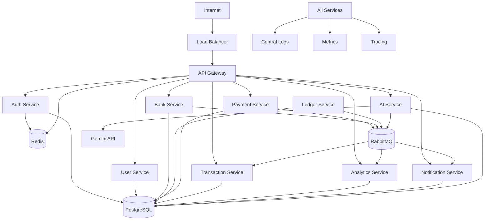

# VERO AI Deployment Architecture

## 1. Deployment Goals

VERO AI should be easy to run locally while demonstrating production-grade fintech operations. The deployment design uses containers, environment-specific configuration, PostgreSQL, Redis, RabbitMQ, centralized logging, metrics, tracing, and CI/CD gates.

## 2. Environment Overview

| Environment | Purpose | Characteristics |
| --- | --- | --- |
| Development | Local engineering and demos | Docker Compose, seeded sandbox data, relaxed scaling. |
| Staging | Production-like validation | Managed or containerized services, realistic secrets, monitoring enabled. |
| Production | Public showcase and portfolio-grade runtime | Hardened containers, private networking, backups, alerts, CI/CD promotion. |

## 3. Logical Deployment Diagram

## 4. Container Strategy

### Service Containers

Each service runs as an independent container:

- `api-gateway`.
- `auth-service`.
- `user-service`.
- `bank-service`.
- `ledger-service`.
- `payment-service`.
- `transaction-service`.
- `analytics-service`.
- `notification-service`.
- `ai-service`.

### Container Requirements

| Requirement | Description |
| --- | --- |
| Non-root user | Containers must not run as root. |
| Health check | Each service exposes liveness and readiness endpoints. |
| Graceful shutdown | Services drain in-flight requests and queue consumers. |
| Config by environment | No hardcoded secrets or environment-specific values. |
| Structured logs | JSON logs with request ID and service name. |
| Image tags | Immutable tags based on commit SHA. |

## 5. Development Environment

### Components

- Docker Compose.
- PostgreSQL.
- Redis.
- RabbitMQ with management UI.
- All backend services.
- Optional local mobile app connection.
- Optional fake OTP provider.
- Gemini integration enabled through local secret.

### Development Defaults

| Setting | Default |
| --- | --- |
| API base URL | `http://localhost:<gateway-port>/v1`. |
| OTP mode | Sandbox OTP logged to console or fixed test OTP. |
| Database | Single PostgreSQL container. |
| Queue | Single RabbitMQ container. |
| Redis | Single Redis container. |
| Observability | Local logs and optional Prometheus/Grafana. |

### Development Data

Seed data should include:

- Test users with virtual accounts.
- Generated UPI IDs.
- Admin-controlled initial balances.
- Example transactions.
- Example goals.
- Example AI insights.

## 6. Staging Environment

### Purpose

Staging validates production-like behavior before release.

### Requirements

- Same container images as production.
- Separate staging secrets.
- Database migrations run automatically through CI/CD.
- RabbitMQ queues and DLQs enabled.
- Monitoring and alerting enabled.
- Gemini key uses non-production quota or project.
- Synthetic tests run after deployment.

### Staging Gates

- Database migrations succeed.
- Health checks pass.
- OTP login smoke test passes.
- Account provisioning smoke test passes.
- Send money smoke test passes.
- Ledger reconciliation check passes.
- AI chat smoke test passes.
- No unexpected DLQ messages after smoke tests.

## 7. Production Environment

### Requirements

- Only API Gateway is internet-facing.
- Services run in private subnets or private container network.
- PostgreSQL is private and backed up.
- Redis and RabbitMQ are private.
- Secrets come from a secrets manager.
- Structured logs, metrics, and traces are centralized.
- Alerts are routed to operators.

### Production Scaling

| Component | Scaling Strategy |
| --- | --- |
| API Gateway | Horizontal replicas behind load balancer. |
| Auth Service | Horizontal replicas, Redis-backed rate limits. |
| User Service | Horizontal replicas. |
| Bank Service | Horizontal replicas, database uniqueness for account and UPI. |
| Ledger Service | Conservative horizontal scaling with account-level serialization. |
| Payment Service | Horizontal replicas with idempotency. |
| Transaction Service | Horizontal API replicas and queue workers. |
| Analytics Service | Separate API and worker replicas. |
| Notification Service | Queue worker scaling. |
| AI Service | Separate chat API and background insight workers. |
| PostgreSQL | Primary plus read replicas for heavy reads. |
| RabbitMQ | Durable queues, clustered for production if supported. |

## 8. PostgreSQL Deployment

### Requirements

- Automated backups.
- Point-in-time recovery where available.
- Connection pooling.
- Migration tracking.
- Read replicas for transaction history, analytics, and AI retrieval.
- Restricted service credentials per schema or database.

### Backup Policy

| Environment | Policy |
| --- | --- |
| Development | Optional volume persistence. |
| Staging | Daily backup, 7 day retention. |
| Production | Daily full backup, PITR, 30 day retention minimum. |

### Migration Policy

- Migrations are reviewed and versioned.
- Backward-compatible migrations before code rollout.
- Destructive migrations require explicit approval and backup.
- Ledger table migrations require extra review.

## 9. Redis Deployment

### Uses

- OTP challenge rate limiting.
- Gateway rate limiting.
- Token revocation cache.
- Short-lived UPI resolution cache.
- Distributed locks only where strictly necessary.

### Requirements

- Private network access.
- Auth enabled.
- Key TTLs for all cache and rate limit entries.
- No authoritative ledger or payment state stored only in Redis.

## 10. RabbitMQ Deployment

### Uses

- Domain event delivery.
- Outbox publishing.
- AI insight background jobs.
- Notification delivery jobs.
- Dead-letter queues.

### Requirements

- Durable exchanges and queues.
- Persistent messages for domain events.
- Per-domain DLQs.
- Consumer prefetch tuning.
- Queue depth alerts.
- Replay tooling for DLQ events.

## 11. Monitoring

### Metrics

| Area | Metrics |
| --- | --- |
| API | Request rate, latency, error rate by route. |
| Auth | OTP send rate, verify success, verify failure, rate limits. |
| Payments | Initiated, completed, failed, p95 latency, failure codes. |
| Ledger | Posting count, rejection count, reconciliation failures. |
| Events | Publish lag, consumer lag, retry count, DLQ count. |
| AI | Gemini latency, timeout rate, fallback rate, insight generation count. |
| Database | Connections, query latency, locks, replication lag. |
| Infrastructure | CPU, memory, disk, network. |

### Dashboards

- Executive product health.
- Payment operations.
- Ledger integrity.
- Event processing.
- AI quality and latency.
- Infrastructure health.

## 12. Logging

### Log Requirements

- JSON structured logs.
- Include service name, environment, request ID, user ID when safe, and correlation ID.
- Redact mobile numbers, OTPs, tokens, secrets, and raw Gemini credentials.
- Separate audit logs from application logs.
- Retain production logs according to environment policy.

### Log Levels

| Level | Use |
| --- | --- |
| `DEBUG` | Local development only. |
| `INFO` | Normal business events and lifecycle. |
| `WARN` | Recoverable failures and retries. |
| `ERROR` | Failed requests, failed jobs, unexpected exceptions. |
| `CRITICAL` | Ledger inconsistency, auth compromise, or systemic outage. |

## 13. Tracing

Distributed tracing should propagate:

- `X-Request-ID`.
- Trace ID.
- Span ID.
- User ID hash where safe.
- Event correlation ID.

Important traces:

- OTP verification.
- Registration and account provisioning.
- Send money.
- Request money approval.
- QR payment.
- AI chat.
- Insight generation.

## 14. CI/CD

### Pipeline Stages

```mermaid
flowchart LR
  A[Pull Request] --> B[Static Checks]
  B --> C[Unit Tests]
  C --> D[Build Images]
  D --> E[Security Scan]
  E --> F[Integration Tests]
  F --> G[Deploy Staging]
  G --> H[Smoke Tests]
  H --> I[Manual Approval]
  I --> J[Deploy Production]
  J --> K[Post Deploy Checks]
```

### Required Checks

- Formatting and linting.
- Unit tests.
- Integration tests for payment and ledger flows.
- API contract tests.
- Event contract tests.
- Migration validation.
- Container vulnerability scan.
- Secret scan.

### Deployment Strategy

| Environment | Strategy |
| --- | --- |
| Development | Local rebuild and restart. |
| Staging | Automatic deploy from main branch. |
| Production | Manual approval, rolling deploy. |

## 15. Release Safety

### Backward Compatibility

- Deploy database migrations before code requiring new columns.
- Keep old API fields until mobile clients are migrated.
- Event consumers tolerate unknown fields.
- Producers avoid breaking event schema changes.

### Rollback

- Application rollback uses previous image tag.
- Database rollback is avoided for ledger-impacting changes; use forward fixes where possible.
- AI prompt rollback is configuration-based.
- Feature flags disable risky capabilities.

## 16. Health Checks

| Check | Purpose |
| --- | --- |
| `/health/live` | Process is running. |
| `/health/ready` | Service can accept traffic. |
| Database connectivity | Required for readiness if service depends on DB. |
| Redis connectivity | Required for Gateway and Auth readiness. |
| RabbitMQ connectivity | Required for workers, optional for APIs depending on endpoint. |
| Gemini connectivity | Not required for core readiness; AI Service reports degraded mode. |

## 17. Runbooks

Production should include runbooks for:

- OTP delivery failure.
- Payment failure spike.
- Ledger reconciliation failure.
- RabbitMQ DLQ growth.
- PostgreSQL high lock contention.
- Redis outage.
- Gemini outage.
- Token signing key rotation.
- Suspected secret leak.

## 18. Environment Configuration

| Config | Development | Staging | Production |
| --- | --- | --- | --- |
| Secrets | Local env file | Secrets manager | Secrets manager |
| OTP | Console or fixed test OTP | Sandbox provider | Provider or controlled sandbox mode |
| Gemini | Optional developer key | Staging Gemini project | Production Gemini project |
| Logging | Console | Centralized | Centralized |
| Metrics | Optional | Required | Required |
| Backups | Optional | Required | Required |
| TLS | Optional local | Required | Required |

